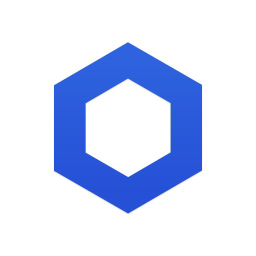
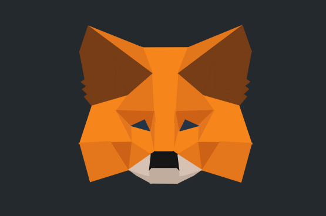
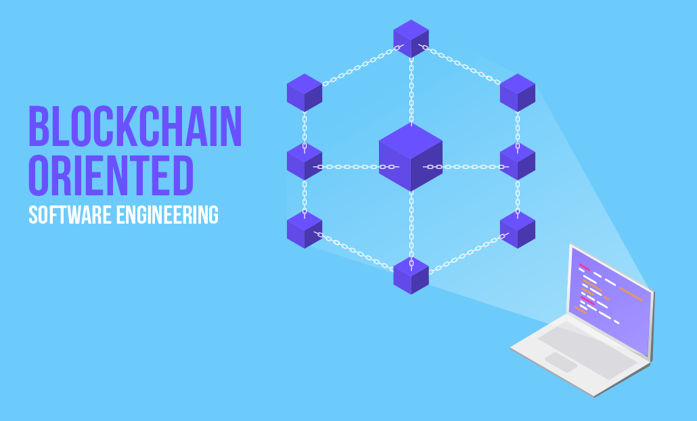

# Blockchain Engineer Here 
 My name is Michael McClimon and I have been developing on the Blockchain for over six months now and am seeking a full-time role as a Developer. I am currently enrolled in the Ivan On Tech academy where the community behind crypto couldn't be stronger! Learning Solidity, Go, JavaScript I have built real-world Smart Contracts and am currently working on my first Dapp clone. If you're looking for a passionate individual to bring your development team to the next level look no further! 
  

### 🔨 Tech Stack

  
  
  
  
  
  
  
  
  
  
  
  
  
  
  

  
 
 
 
 

 

### 📈 GitHub Stats 

- 👀 I’m interested in Blockchain Technologies
- 🌱 I’m currently building a Crypto Kitties Dapp clone
- 💞️ I’m looking to collaborate on Blockchain projects for businesses.
 ### Social Media 

- 📫 How to contact me? @ ----> mickeymcclimon@gmail.com

<!---
michaelmcclimon/michaelmcclimon is a ✨ special ✨ repository because its `README.md` (this file) appears on your GitHub profile.
You can click the Preview link to take a look at your changes.
--->
